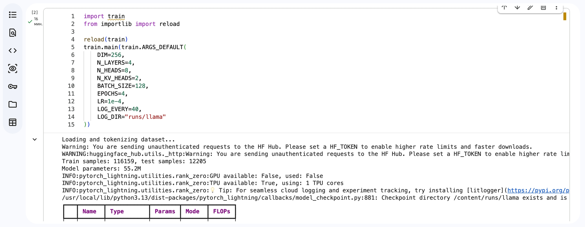
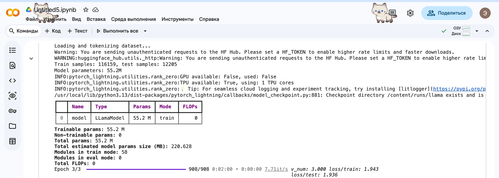
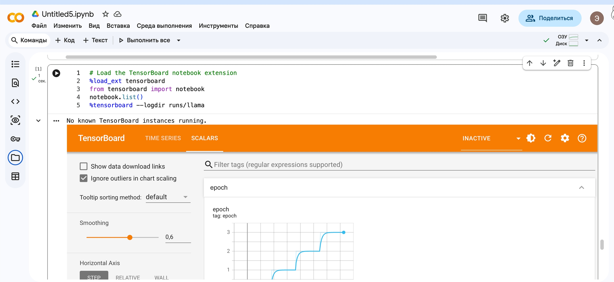
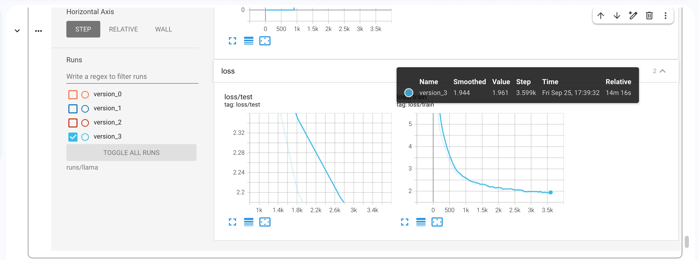
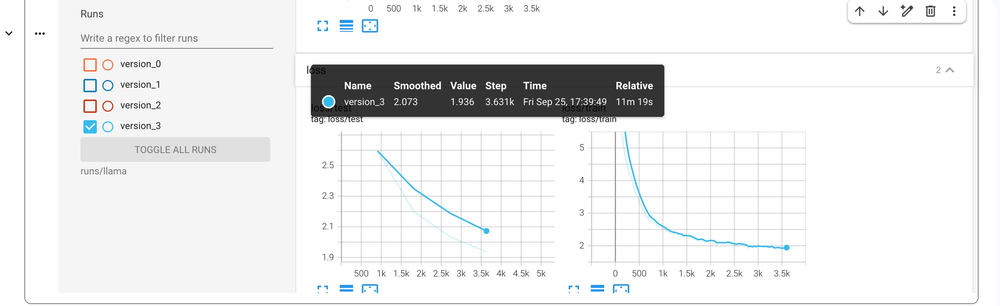

# modern_llm_hw
Репозиторий для домашек по курсу Современные LLM

Модель обучалась с параметрами:

ARGS_DEFAULT(
    
    DIM=256,

    N_LAYERS=4,

    N_HEADS=8,

    N_KV_HEADS=2,

    BATCH_SIZE=128,

    EPOCHS=4,

    LR=1e-4,

    LOG_EVERY=40,

    LOG_DIR="runs/llama"
)

Эпсилон для RoPE захардкожено в 1e-6 и внутренняя размерность FFN х4 от входа согласно оригинальной архитектуре.

В качестве датасета взяла тексты гороскопов, в качестве токенизатора - тиктокен cl100k_base. 

Запуск обучения с параметрами:

Тензорборд графики:

Эпохи:

Лосс на обучении:

Лосс на валидации:
